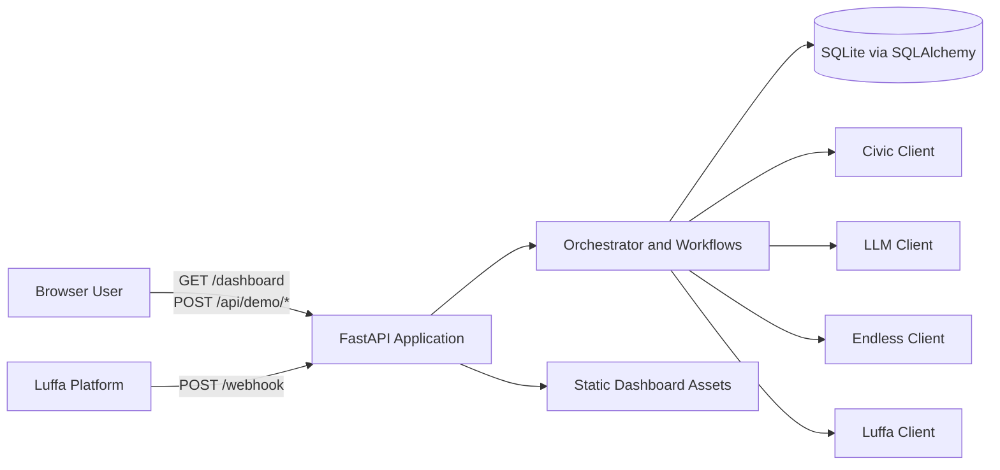
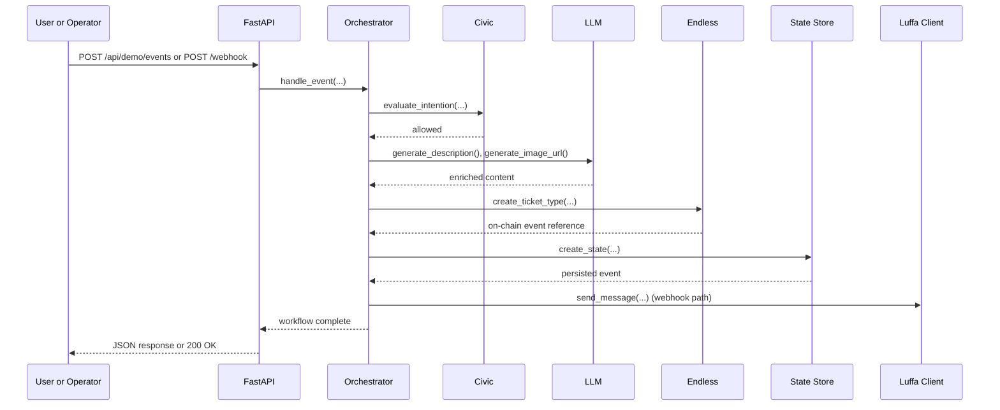

# System Architecture: Encode ShowRunner

## Overview

Encode ShowRunner is a lightweight AI-driven event orchestration system built for the Encode AI London hackathon. It combines a FastAPI backend, a browser-based operations dashboard, and a small set of domain-specific integration clients to manage the event lifecycle from creation through settlement and payout approval.

At present, the system is implemented as a modular monolith. One Python application serves the dashboard, exposes HTTP APIs, receives webhook events from Luffa, persists event state in SQLite, and coordinates stubbed integrations for Endless, Civic, and LLM-backed content generation. This structure keeps the project easy to run locally while preserving clear boundaries that can evolve into production-grade services later.

## Key Requirements

- Support event lifecycle operations: create event, simulate sales, settle revenue, and approve payout.
- Accept webhook-driven commands and button clicks from the Luffa messaging platform.
- Provide a browser-based operations dashboard for local demonstration and manual testing.
- Persist event state reliably between requests.
- Keep local development simple, with minimal infrastructure requirements.
- Remain extensible so stubbed integrations can be replaced with real external services.
- Provide predictable behaviour for demos and tests, including a reset path for seeded data.
- Fail safely with structured API errors and clear lifecycle guards.

## High-Level Architecture

Encode ShowRunner uses a single FastAPI application as the runtime boundary. The application exposes both human-facing and machine-facing interfaces: static dashboard assets for browser users, JSON endpoints for demo operations, and a webhook endpoint for Luffa-originated events. Incoming commands are normalised into internal event objects, routed through orchestrator logic, and executed by workflow functions that coordinate persistence, guardrails, messaging, and settlement logic.

The design follows a layered approach:

- Presentation layer: dashboard HTML/CSS/JavaScript and HTTP route handlers.
- Application layer: orchestrator, workflows, lifecycle validation, and error handling.
- Integration layer: Luffa, Endless, Civic, and LLM clients.
- Persistence layer: SQLAlchemy-backed state store over SQLite.

This diagram shows the current container-level view: one deployable application coordinates the dashboard, webhook processing, persistence, and all external integrations.

## Component Details

### Dashboard Web Client

**Responsibilities**

- Render the event operations dashboard.
- Submit event creation, sale, settlement, payout, and reset actions to the backend.
- Present loading, empty, success, and error states for operators.

**Main technologies**

- Static HTML, CSS, and JavaScript served by FastAPI.

**Important data owned**

- No durable business data.
- Transient browser state such as form values, rendered events, and pending UI actions.

**Communication**

- Calls FastAPI JSON endpoints under `/api/*`.
- Receives HTML from `/` or `/dashboard`.

### FastAPI Application

**Responsibilities**

- Serve the dashboard and static assets.
- Expose health, event inspection, sales summary, and demo lifecycle endpoints.
- Receive webhook payloads from Luffa.
- Convert internal exceptions into structured JSON errors.

**Main technologies**

- FastAPI
- Starlette static file serving
- Pydantic models for request validation

**Important data owned**

- API contracts and request validation rules.
- Lifecycle guards for allowed state transitions.

**Communication**

- Receives HTTP requests from browsers and external webhook senders.
- Delegates business actions to the orchestrator and workflows.
- Reads and writes event state through the state store.

### Orchestrator and Workflow Layer

**Responsibilities**

- Parse incoming Luffa events into supported internal event types.
- Route commands and button actions to the appropriate workflow.
- Coordinate LLM enrichment, Civic checks, Endless ticketing or settlement calls, and Luffa notifications.
- Maintain lifecycle progression from `open` to `ready_for_payout` to `settled`.

**Main technologies**

- Python application services in `app/agent/orchestrator.py` and `app/agent/workflows.py`

**Important data owned**

- Workflow control flow and lifecycle rules.
- Button payload conventions and command parsing.

**Communication**

- Called by FastAPI webhook and demo endpoints.
- Uses the state store and integration clients.

### State Store

**Responsibilities**

- Persist event records.
- Retrieve events by primary key, channel, and on-chain identifier.
- Provide grouped counts and list views for the dashboard.
- Support demo reset by deleting persisted events.

**Main technologies**

- SQLAlchemy ORM
- SQLite

**Important data owned**

- Event metadata: title, description, status, banner URL, price, supply, channel ID, and on-chain event ID.

**Communication**

- Invoked by route handlers and workflows.
- Stores data locally in the configured SQLite database.

### Luffa Client

**Responsibilities**

- Send bot-originated messages or cards back to the messaging platform.
- Provide a stubbed fallback when real network connectivity is not available.

**Main technologies**

- Python HTTP client behaviour with stubbed responses in local mode

**Important data owned**

- No durable state; only outbound request payloads.

**Communication**

- Called by workflows after event creation, settlement, or payout approval.

### Endless Client

**Responsibilities**

- Create ticket types for newly created events.
- Record simulated sales.
- Produce sales summaries and payout amounts.
- Execute or simulate payout approval.
- Reset in-memory demo state.

**Main technologies**

- In-memory Python stub

**Important data owned**

- Ticket definitions
- Simulated sales records
- Generated payout transaction references

**Communication**

- Called by workflows and demo routes.

### Civic Client

**Responsibilities**

- Evaluate whether a workflow action is allowed before side effects occur.

**Main technologies**

- In-memory policy stub

**Important data owned**

- Policy decisions generated from tool intention inputs.

**Communication**

- Called from workflow guard points before external actions are executed.

### LLM Client

**Responsibilities**

- Generate richer event descriptions.
- Produce event banner image URLs.
- Fall back deterministically when OpenAI or network access is unavailable.

**Main technologies**

- Optional OpenAI SDK integration
- Deterministic local fallback logic

**Important data owned**

- No persistent data; only generated text and image URLs.

**Communication**

- Called during event creation workflows.

## Data Flow

Two primary flows drive the system: dashboard-driven operations and webhook-driven orchestration. Both converge on the same workflow layer so the business logic remains consistent regardless of entry point.

### Event Creation Flow

1. An operator submits the dashboard event creation form, or a Luffa user sends `/create_event`.
2. FastAPI validates the request or webhook payload.
3. The orchestrator parses the event and routes it to the event creation workflow.
4. Civic evaluates whether the workflow is allowed.
5. The LLM client generates the enriched description and banner URL.
6. The Endless client creates a ticket type and returns an identifier.
7. The state store persists the new event as `open`.
8. The Luffa client sends a confirmation message for webhook-driven flows.
9. The dashboard refreshes by fetching `/api/events`.

This sequence shows how one business action crosses presentation, policy, enrichment, integration, and persistence boundaries while remaining inside a single deployable application.

### Settlement and Payout Flow

1. An operator triggers settlement from the dashboard or a button click arrives from Luffa.
2. FastAPI or the webhook route resolves the event and validates the current lifecycle state.
3. The settlement workflow reads sales data from Endless.
4. The state store updates the event to `ready_for_payout`.
5. A later payout approval triggers the payout workflow.
6. The Endless client simulates payout execution.
7. The state store marks the event as `settled`.

## Data Model (High-Level)

The current domain model is intentionally compact.

- `EventState`
  - Represents the canonical persisted record for an event lifecycle instance.
  - Key fields: `id`, `channel_id`, `status`, `title`, `description`, `banner_url`, `price`, `supply`, `onchain_event_id`.

- `TicketType`
  - Stored inside the Endless stub.
  - Represents ticket configuration for an event, including price and supply.

- `Sale`
  - Stored in-memory by the Endless stub.
  - Represents a buyer and a quantity for simulated sales accounting.

High-level relationships:

- One `EventState` maps to one primary ticket definition in the Endless stub.
- One `EventState` can have many sales records.
- One `EventState` progresses through a small state machine: `open -> ready_for_payout -> settled`.

## Infrastructure & Deployment

The current deployment model is a single-process Python web application. In development, the service is typically started with Uvicorn using `uvicorn app.main:app --reload --port 8000`. Static assets are served from the same process, and SQLite is used as an embedded datastore.

Current environment assumptions:

- **Development**: local workstation, Uvicorn reload enabled, SQLite file on local disk, stubbed integrations.
- **Staging**: `<ADD DETAIL HERE>`; likely a single container or VM with a persistent volume for SQLite or a move to PostgreSQL.
- **Production**: `<ADD DETAIL HERE>`; recommended to use a container image, managed secrets, externalised storage, and real downstream integrations.

The repository notes Docker as optional but not yet implemented. At present, the architecture should be treated as a development-first deployment rather than a horizontally scaled production platform.

## Scalability & Reliability

The current design prioritises simplicity over scale. Reliability is achieved mainly through deterministic local state, explicit tests, and structured error responses rather than through distributed systems patterns.

Current characteristics:

- Single application instance with no load balancer.
- SQLite provides simple local persistence but is not ideal for multi-writer or high-concurrency workloads.
- External integrations are stubbed, so demo flows are resilient to network absence.
- API transition guards prevent invalid lifecycle actions.
- Indexed lookup paths improve event read performance as data volume grows.

Recommended next steps for scale and resilience:

- Replace SQLite with PostgreSQL for concurrent access and stronger operational guarantees.
- Introduce background jobs or a queue for long-running enrichment or settlement tasks.
- Add idempotency keys for webhook processing.
- Run multiple stateless API instances behind a load balancer once persistence is externalised.

## Security & Compliance

Security is minimal and appropriate for a hackathon prototype, but not yet sufficient for a production deployment.

Current measures:

- Configuration is loaded from environment variables rather than hard-coded secrets.
- Civic provides a policy decision point before selected side effects.
- Structured validation is applied to HTTP request bodies.
- Error responses are normalised to reduce accidental leakage of raw exceptions.

Current gaps:

- No user authentication or authorisation for dashboard or API routes.
- No webhook signature verification for inbound Luffa traffic.
- No transport or secret-management layer is described beyond environment variables.
- No audit log for operator actions.

Compliance considerations:

- Personal data exposure appears limited in the current demo, but operator IDs, buyer references, or future payment metadata may become personal data.
- If real user or payment data is introduced, the system should define retention, lawful basis, and deletion processes aligned with UK GDPR or other applicable regulations.

## Observability

Observability is currently log-centric.

- Application logs use Python standard logging with a shared formatter.
- Test coverage acts as a regression safety net for lifecycle flows and HTTP contracts.
- Structured API error responses improve operator and developer visibility during failures.

Missing observability capabilities that would be valuable next:

- Metrics for request rates, latency, settlement duration, and error counts.
- Distributed tracing across webhook ingestion, workflow execution, and external integrations.
- Health probes for downstream dependency readiness.
- Centralised log shipping and retention.

## Trade-offs & Decisions

### Design Decisions

- **Modular monolith over microservices**: chosen to reduce delivery overhead and keep the hackathon scope manageable.
- **SQLite over networked database**: chosen for zero-friction local setup, at the cost of concurrency and production readiness.
- **Stubbed integrations over live services**: chosen to enable deterministic demos and tests without requiring paid or unstable external dependencies.
- **Single runtime for dashboard and API**: chosen to keep deployment and cross-layer debugging simple.

### Trade-offs

- The system is easy to understand and run locally, but it couples UI delivery, orchestration, and API serving into one deployable unit.
- In-memory integration stubs make development fast, but they hide some failure modes that real distributed systems would introduce.
- The current lifecycle logic is straightforward, but state transitions are enforced procedurally rather than through a dedicated domain model or workflow engine.

## Future Improvements

- Replace stubbed Luffa, Endless, and Civic clients with real service adapters.
- Move persistence from SQLite to PostgreSQL.
- Add authentication, authorisation, and signed webhook verification.
- Introduce asynchronous job execution for enrichment and settlement workloads.
- Model lifecycle transitions explicitly with a small state machine or command layer.
- Add idempotent webhook processing and retry handling.
- Containerise the application and define staging and production deployment manifests.
- Add metrics, tracing, and alerting for operational visibility.
