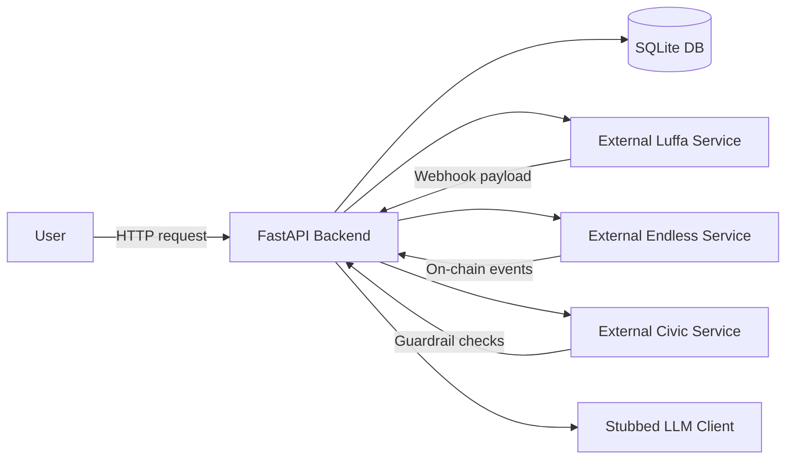

# Encode ShowRunner
*AI‑driven event orchestration bot for the Encode AI London hackathon*

---

## Badges
[](<!-- placeholder -->)
[](<!-- placeholder -->)
[](LICENSE)

---

## Description
Encode ShowRunner is a lightweight **AI‑driven event orchestration bot** that integrates with the **Luffa** messaging platform, the **Endless** on‑chain ticketing system, and **Civic** guardrails. It listens for Luffa webhook events, routes them through orchestrated workflows, and manages the full lifecycle of an event: creation, settlement, and payout. All state is persisted in a local SQLite database via SQLAlchemy, and a stubbed LLM client provides placeholder content generation.

---

## Table of Contents
- [Features](#features)
- [Tech Stack](#tech-stack)
- [Architecture Overview](#architecture-overview)
- [Installation](#installation)
- [Usage](#usage)
- [Configuration](#configuration)
- [Screenshots / Demo](#screenshots--demo)
- [API Reference](#api-reference)
- [Tests](#tests)
- [Roadmap](#roadmap)
- [Contributing](#contributing)
- [License](#license)
- [Contact / Support](#contact--support)

---

## Features
- **Webhook listener** for Luffa events (commands, button clicks)
- **Event creation workflow** – generates title, description, banner, on‑chain event, and interactive card
- **Settlement workflow** – opens ticket sales and updates UI with “Approve Payout” button
- **Payout workflow** – distributes proceeds between organiser and treasury
- **SQLite persistence** via SQLAlchemy
- **Stubbed LLM client** for content generation (easy to replace with a real model)
- **Modular architecture** with separate clients for Luffa, Endless, Civic, and LLM

---

## Tech Stack
- **Python 3.11**
- **FastAPI** (web framework)
- **Uvicorn** (ASGI server)
- **SQLAlchemy** (ORM) + **SQLite** (local DB)
- **Pydantic‑Settings** (configuration)
- **pytest** (testing)
- **Docker** (optional, not yet containerised)
- **Luffa**, **Endless**, **Civic** (stubbed external integrations)

---

## Architecture Overview

*The diagram shows the core FastAPI backend handling HTTP/webhook traffic, persisting state in SQLite, and communicating with external services (Luffa, Endless, Civic) as well as a stubbed LLM client for content generation.*

---

## Installation
1. **Clone the repository**
   ```bash
   git clone <repo-url>
   cd Encode\ ShowRunner
   ```
2. **Create a virtual environment & install dependencies**
   ```bash
   python3 -m venv .venv
   source .venv/bin/activate
   pip install -r requirements.txt
   ```
3. **Configure environment variables**
   ```bash
   cp .env.example .env
   # Edit .env with your API tokens, DB URL, etc.
   ```
4. **Run the FastAPI server**
   ```bash
   uvicorn app.main:app --reload --port 8000
   ```
   Health endpoint: `GET http://localhost:8000/` returns `{"message": "ShowRunner API is running"}`.

---

## Usage
### Start the server
```bash
uvicorn app.main:app --reload --port 8000
```

### Send a sample webhook (create event)
```bash
curl -X POST http://localhost:8000/webhook \
  -H "Content-Type: application/json" \
  -d '{
        "type": "command",
        "channel_id": "C123",
        "user_id": "U456",
        "text": "/create_event"
      }'
```
The bot will respond with a card containing a **Start Settlement** button. Simulate a button click with a `button_click` payload to trigger the settlement workflow, followed by an **Approve Payout** button to complete the process.

---

## Configuration
All configurable values are loaded from a `.env` file via **pydantic‑settings**. Key variables include:

| Variable | Description |
|----------|-------------|
| `DATABASE_URL` | SQLite connection string (default `sqlite:///showrunner.db`) |
| `LUFFA_TOKEN` | API token for Luffa integration |
| `ENDLESS_API_KEY` | API key for Endless on‑chain client |
| `CIVIC_API_KEY` | API key for Civic guardrails |
| `LLM_ENDPOINT` | URL for the LLM service (stubbed by default) |
| `LOG_LEVEL` | Logging verbosity (`INFO`, `DEBUG`, etc.) |

---

## Screenshots / Demo
*Placeholder – add screenshots of the bot card UI or a link to a live demo.*

---

## API Reference
- **GET /** – Health check (`{"message": "ShowRunner API is running"}`)
- **POST /webhook** – Accepts Luffa webhook payloads (command, button click, etc.)
- **POST /admin/reload** – (Future) endpoint to reload configuration without restart

---

## Tests
The project uses **pytest**. Run the test suite with:
```bash
pytest
```

---

## Roadmap
- Replace stubbed LLM client with a real LLM (e.g., OpenAI, Claude)
- Implement real Luffa, Endless, and Civic clients
- Add Dockerfile and CI pipeline for automated builds/tests
- Introduce rate‑limiting and retry logic for external calls
- Expand test coverage with property‑based tests (`hypothesis`)

---

## Contributing
Contributions are welcome! Please:

1. Fork the repository
2. Create a feature branch (`git checkout -b feature/your‑feature`)
3. Write tests for your changes
4. Ensure `pytest` passes and the code follows existing style
5. Open a Pull Request describing the change

---

## License
MIT License – see the `LICENSE` file for details.

---

## Contact / Support
**Maintainer:** <MAINTAINER NAME>
- GitHub: <https://github.com/<USERNAME>>
- Email: <maintainer@example.com>
