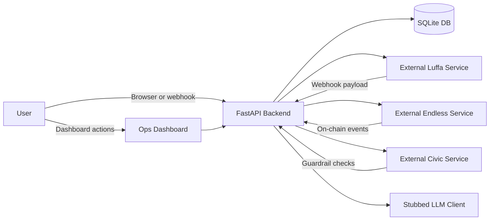

# Encode ShowRunner
*AI‑driven event orchestration bot for the Encode AI London hackathon*

---

## Badges
[](<!-- placeholder -->)
[](<!-- placeholder -->)
[](LICENSE)

---

## Description
Encode ShowRunner is a lightweight **AI‑driven event orchestration bot** that integrates with the **Luffa** messaging platform, the **Endless** on-chain ticketing system, and **Civic** guardrails. It listens for Luffa webhook events, routes them through orchestrated workflows, and manages the full lifecycle of an event: creation, settlement, and payout. All state is persisted in SQLite via SQLAlchemy, and the app now includes a browser-based operations dashboard for creating events, simulating sales, settling revenue, and approving payouts.

---

## Table of Contents
- [Features](#features)
- [Tech Stack](#tech-stack)
- [Architecture Overview](#architecture-overview)
- [Installation](#installation)
- [Usage](#usage)
- [Configuration](#configuration)
- [Screenshots / Demo](#screenshots--demo)
- [API Reference](#api-reference)
- [Tests](#tests)
- [Roadmap](#roadmap)
- [Contributing](#contributing)
- [License](#license)
- [Contact / Support](#contact--support)

---

## Features
- **Webhook listener** for Luffa events (commands, button clicks)
- **Operations dashboard** for running the event lifecycle in a browser
- **Event creation workflow** – generates title, description, banner, on‑chain event, and interactive card
- **Settlement workflow** – computes sales, moves events into a payout-ready state, and updates the UI
- **Payout workflow** – distributes proceeds between organiser and treasury
- **SQLite persistence** via SQLAlchemy
- **Stubbed LLM client** for content generation (easy to replace with a real model)
- **Modular architecture** with separate clients for Luffa, Endless, Civic, and LLM

---

## Tech Stack
- **Python 3.11**
- **FastAPI** (web framework)
- **Uvicorn** (ASGI server)
- **SQLAlchemy** (ORM) + **SQLite** (local DB)
- **Pydantic‑Settings** (configuration)
- **pytest** (testing)
- **Docker** (optional, not yet containerised)
- **Luffa**, **Endless**, **Civic** (stubbed external integrations)

---

## Architecture Overview

*The dashboard and webhook routes both flow through the same FastAPI backend. The backend persists event state in SQLite and coordinates the stubbed Luffa, Endless, Civic, and LLM integrations so the full event lifecycle can be exercised locally.*

---

## Installation
1. **Clone the repository**
   ```bash
   git clone <repo-url>
   cd Encode\ ShowRunner
   ```
2. **Create a virtual environment & install dependencies**
   ```bash
   python3 -m venv .venv
   source .venv/bin/activate
   pip install -r requirements.txt
   ```
3. **Configure environment variables**
   ```bash
   cp .env.example .env
   # Edit .env with your API tokens, DB URL, etc.
   ```
4. **Run the FastAPI server**
   ```bash
   uvicorn app.main:app --reload --port 8000
   ```
   Dashboard: `http://localhost:8000/dashboard`
   Health endpoint: `GET http://localhost:8000/api/health` returns `{"message": "ShowRunner API is running"}`.

---

## Usage
### Start the server
```bash
uvicorn app.main:app --reload --port 8000
```

### Open the dashboard
Visit `http://localhost:8000/dashboard` to:
- create demo events
- simulate ticket sales
- trigger settlement
- approve payout with a confirmation dialog

### Send a sample webhook (create event)
```bash
curl -X POST http://localhost:8000/webhook \
  -H "Content-Type: application/json" \
  -d '{
        "type": "command",
        "channel_id": "C123",
        "user_id": "U456",
        "text": "/create_event"
      }'
```
The bot will respond with a card containing a **Start Settlement** button. Simulate a button click with a `button_click` payload to trigger the settlement workflow, followed by an **Approve Payout** button to complete the process.

---

## Configuration
All configurable values are loaded from a `.env` file via **pydantic‑settings**. Key variables include:

| Variable | Description |
|----------|-------------|
| `DATABASE_URL` | SQLite connection string (default `sqlite:///showrunner.db`) |
| `LUFFA_API_BASE_URL` | Base URL for the Luffa integration |
| `LUFFA_API_TOKEN` | API token for Luffa integration |
| `ENDLESS_API_BASE_URL` | Base URL for the Endless client |
| `ENDLESS_API_TOKEN` | API token for the Endless client |
| `CIVIC_API_BASE_URL` | Base URL for Civic guardrails |
| `CIVIC_API_TOKEN` | API token for Civic guardrails |
| `OPENAI_API_KEY` | API key for the optional OpenAI-backed LLM client |
| `OPENAI_MODEL` | Model name used for description generation |

---

## Screenshots / Demo
*Placeholder – add screenshots of the operations dashboard and lifecycle cards, or link to a hosted demo.*

---

## API Reference
- **GET /** – Returns the HTML dashboard for browsers and JSON health for API clients
- **GET /dashboard** – Serves the operations dashboard
- **GET /api/health** – JSON health check
- **GET /api/events** – Returns recent event state and dashboard summary counts
- **POST /api/demo/events** – Creates a demo event from form input
- **POST /api/demo/events/{state_id}/sales** – Records simulated ticket sales
- **POST /api/demo/events/{state_id}/settle** – Runs settlement for an event
- **POST /api/demo/events/{state_id}/payout** – Approves payout for an event
- **POST /webhook** – Accepts Luffa webhook payloads (command, button click, etc.)

---

## Tests
The project uses **pytest**. Run the test suite with:
```bash
pytest
```
Tests automatically use an isolated temporary SQLite database so local development data is not mutated during a test run.

---

## Roadmap
- Replace stubbed LLM client with a real LLM (e.g., OpenAI, Claude)
- Implement real Luffa, Endless, and Civic clients
- Add Dockerfile and CI pipeline for automated builds/tests
- Introduce rate‑limiting and retry logic for external calls
- Expand test coverage with property‑based tests (`hypothesis`)

---

## Contributing
Contributions are welcome! Please:

1. Fork the repository
2. Create a feature branch (`git checkout -b feature/your‑feature`)
3. Write tests for your changes
4. Ensure `pytest` passes and the code follows existing style
5. Open a Pull Request describing the change

---

## License
MIT License – see the `LICENSE` file for details.

---

## Contact / Support
**Maintainer:** <MAINTAINER NAME>
- GitHub: <https://github.com/<USERNAME>>
- Email: <maintainer@example.com>
