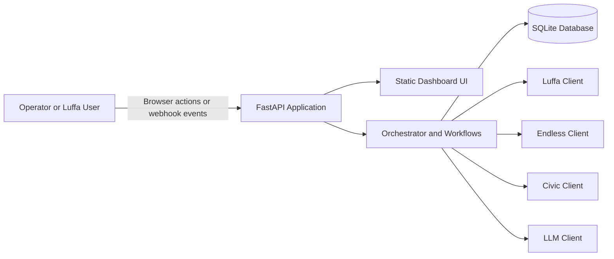

# Encode ShowRunner
*AI-driven event orchestration bot for hackathon demos and operator-led event flows.*

[](#tests)
[](#tests)
[](LICENSE)

## Description

Encode ShowRunner is a lightweight FastAPI application that orchestrates the full lifecycle of a demo event: creation, sales simulation, settlement, and payout approval. It integrates with Luffa for inbound commands and outbound messages, Endless for ticketing and payout simulation, Civic for guardrail decisions, and an optional OpenAI-backed LLM client for content generation.

The project is aimed at hackathon teams, judges, and developers who need a runnable end-to-end event operations demo without depending on live third-party infrastructure. A browser dashboard and webhook entrypoint both drive the same workflow layer, while SQLite persistence keeps state across requests during local development.

## Table of Contents

- [Features](#features)
- [Tech Stack](#tech-stack)
- [Architecture Overview](#architecture-overview)
- [Installation](#installation)
- [Usage](#usage)
- [Configuration](#configuration)
- [Screenshots / Demo](#screenshots--demo)
- [API Reference](#api-reference)
- [Tests](#tests)
- [Roadmap](#roadmap)
- [Contributing](#contributing)
- [License](#license)
- [Contact / Support](#contact--support)

## Features

- Browser-based operations dashboard for event creation and lifecycle control
- Luffa webhook ingestion for slash commands and button-click actions
- Workflow-driven event creation with description and banner generation
- Simulated ticket sales, settlement reporting, and payout approval
- SQLite-backed event persistence via SQLAlchemy
- Structured API error responses and lifecycle transition guards
- Demo reset flow for repeatable local testing
- Isolated pytest setup that avoids mutating local development data

## Tech Stack

- Python 3.11+
- FastAPI
- Uvicorn
- SQLAlchemy
- SQLite
- Pydantic Settings
- pytest
- httpx
- OpenAI Python SDK for optional LLM-backed generation

## Architecture Overview



The dashboard and webhook endpoint both enter the same FastAPI application, which keeps business logic in one place. Workflows coordinate persistence and integration clients so event operations behave consistently whether they start from the browser or from Luffa.

For a fuller system view, see [ARCHITECTURE.md](ARCHITECTURE.md).

## Installation

1. Clone the repository.

   ```bash
   git clone https://github.com/MasteraSnackin/ShowRunner.git
   cd ShowRunner
   ```

2. Create and activate a virtual environment.

   ```bash
   python3 -m venv .venv
   source .venv/bin/activate
   ```

3. Install runtime and development dependencies.

   ```bash
   pip install -r requirements.txt
   pip install -r dev-requirements.txt
   ```

4. Create your environment file.

   ```bash
   cp .env.example .env
   ```

5. Start the application locally.

   ```bash
   uvicorn app.main:app --reload --port 8000
   ```

6. Open the dashboard at `http://localhost:8000/dashboard`.

## Usage

### Run the app

```bash
uvicorn app.main:app --reload --port 8000
```

### Use the dashboard

Open `http://localhost:8000/dashboard` and:

- create a demo event
- record simulated sales
- settle an event
- approve payout
- reset the demo workspace

### Send a sample webhook

```bash
curl -X POST http://localhost:8000/webhook \
  -H "Content-Type: application/json" \
  -d '{
        "type": "command",
        "channel_id": "C123",
        "user_id": "U456",
        "text": "/create_event title=\"Launch Party\" description=\"VIP night\""
      }'
```

### Fetch dashboard data

```bash
curl http://localhost:8000/api/events
```

## Configuration

Configuration is loaded from environment variables through `.env`. Key settings from [.env.example](/Users/darkcomet/Documents/Hackathon/Encode%20ShowRunner/.env.example) are listed below.

| Variable | Description |
| --- | --- |
| `APP_ENV` | Runtime environment name, defaults to `development` |
| `PORT` | Local HTTP port, defaults to `8000` |
| `DATABASE_URL` | SQLite connection string, defaults to `sqlite:///./showrunner.db` |
| `LUFFA_API_BASE_URL` | Base URL for the Luffa integration |
| `LUFFA_API_TOKEN` | Token for the Luffa integration |
| `ENDLESS_API_BASE_URL` | Base URL for the Endless integration |
| `ENDLESS_API_TOKEN` | Token for the Endless integration |
| `CIVIC_API_BASE_URL` | Base URL for the Civic integration |
| `CIVIC_API_TOKEN` | Token for the Civic integration |
| `LLM_API_BASE_URL` | Base URL for the placeholder LLM service |
| `OPENAI_API_KEY` | Optional API key for OpenAI-backed description and image generation |
| `OPENAI_MODEL` | Model name used by the LLM client |
| `ORGANISER_ADDRESS` | Demo organiser payout address |
| `TREASURY_ADDRESS` | Demo treasury payout address |
| `ORGANISER_SHARE` | Organiser payout share, defaults to `0.9` |
| `TREASURY_SHARE` | Treasury payout share, defaults to `0.1` |

## Screenshots / Demo

- Dashboard screenshot: `<ADD SCREENSHOT HERE>`
- Lifecycle walkthrough GIF: `<ADD DEMO GIF HERE>`
- Live demo URL: `<ADD DEPLOYMENT URL HERE>`

## API Reference

### Core routes

- `GET /` returns the dashboard for browser requests and a JSON health message for API clients.
- `GET /dashboard` serves the operations dashboard.
- `GET /api/health` returns a simple JSON health payload.
- `POST /webhook` accepts Luffa command and button-click payloads.

### Event routes

- `GET /api/events` returns recent events plus dashboard counts.
- `GET /api/events/{state_id}` returns a single event.
- `GET /api/events/{state_id}/sales-summary` returns tickets sold, revenue, payout amount, and raw sales entries.

### Demo routes

- `POST /api/demo/events` creates an event from dashboard input.
- `POST /api/demo/events/{state_id}/sales` records simulated ticket sales.
- `POST /api/demo/events/{state_id}/settle` runs settlement.
- `POST /api/demo/events/{state_id}/payout` approves payout.
- `POST /api/demo/reset` clears persisted demo events and resets in-memory ticketing state.

Example:

```bash
curl -X POST http://localhost:8000/api/demo/events \
  -H "Content-Type: application/json" \
  -d '{
        "title": "Route Test Event",
        "description": "Exercise the lifecycle end to end.",
        "channel_id": "demo-room"
      }'
```

## Tests

The project uses `pytest` for unit and HTTP-level regression coverage.

Run the full suite with:

```bash
pytest -q
```

Tests automatically use a temporary SQLite database, so local development data is not modified during test runs.

## Roadmap

- Replace stubbed Luffa, Endless, and Civic clients with real service adapters
- Move persistence from SQLite to PostgreSQL for multi-user deployments
- Add webhook signature verification and dashboard authentication
- Introduce background jobs for enrichment and settlement side effects
- Add metrics, tracing, and deployment automation

## Contributing

Contributions are welcome.

1. Fork the repository.
2. Create a feature branch.
3. Add or update tests for your change.
4. Run `pytest -q`.
5. Open a pull request with a clear summary of the change.

Issues and pull requests should be opened on GitHub: <https://github.com/MasteraSnackin/ShowRunner>

## License

MIT License. See the [LICENSE](LICENSE) file for details.

## Contact / Support

- Maintainer: `<ADD MAINTAINER NAME>`
- GitHub: <https://github.com/MasteraSnackin/ShowRunner>
- Email: `<ADD MAINTAINER EMAIL>`
